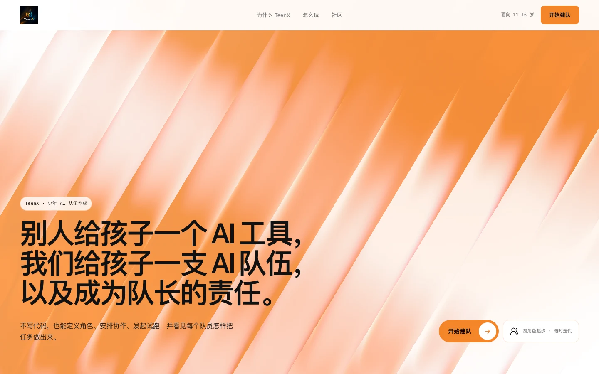
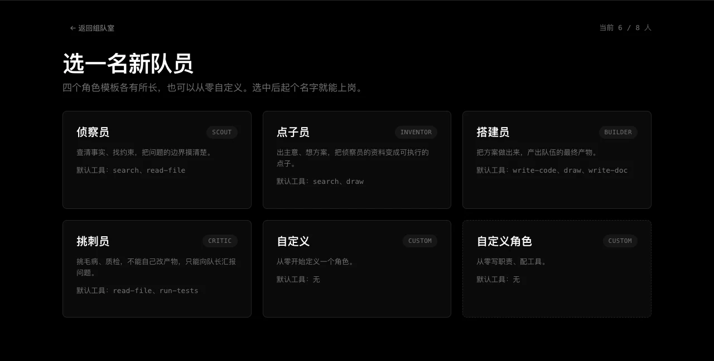
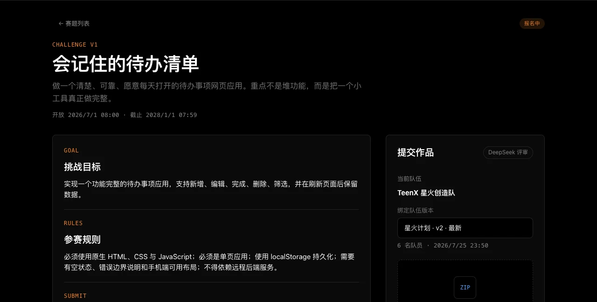
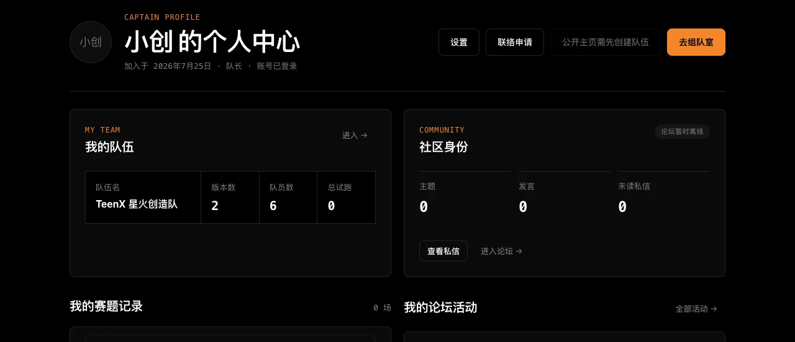

<p align="center">
  <strong>简体中文</strong> &middot; <a href="README_EN.md">English</a>
</p>

<h1 align="center">TeenX · 少年 AI 队伍养成平台</h1>

<p align="center">
  别人给孩子一个 AI 工具，我们给孩子一支 AI 队伍，以及成为队长的责任。
</p>

<p align="center">
  <a href="#快速开始"><strong>快速开始</strong></a> &middot;
  <a href="https://github.com/wunianze666-netizen/TeenX"><strong>GitHub</strong></a> &middot;
  <a href="#架构与安全边界"><strong>架构</strong></a> &middot;
  <a href="#当前限制"><strong>限制</strong></a>
</p>

---

## TeenX 是什么

TeenX 是面向 11–16 岁少年的 AI 队伍养成平台。在这里，孩子不只是 AI 的使用者，更是自己第一支 AI 队伍的**队长（Captain）**：亲手组建队伍、给队员起名、配工具、试跑、看结果、封存版本、继续迭代。

<p align="center">
  
</p>

队伍从四个预置角色模板起步：

| 角色模板 | 职责 | 默认工具 |
| --- | --- | --- |
| 侦察员 Scout | 查清事实、找约束 | 搜索、读文件 |
| 点子员 Inventor | 出主意、想方案 | 搜索、画图 |
| 搭建员 Builder | 把方案做出来 | 写代码、画图、写文档 |
| 挑刺员 Critic | 挑毛病、做质检 | 读文件、跑测试 |

孩子可以在模板基础上加人、删人、改名、换工具，把队伍调成自己的样子。

<p align="center">
  
</p>

## 核心循环

```
定义队伍（加队员 / 起名 / 配工具 / 调协作）
  → 试跑一次（Run）
  → 查看活动记录与产物（Work Product）
  → 封存版本（Team Version）
  → 回到编辑，继续迭代
```

每一次修改都有后果，每一次试跑都有反馈，每一个版本都可回溯。队伍是孩子的长期资产，不是用完即弃的聊天框。

## 术语对照

底层是 Paperclip 控制平面，上层是面向孩子的词汇。数据模型不变，语义重新映射：

| 底层（Paperclip） | 孩子看到的（TeenX） |
| --- | --- |
| Company | 队伍 Team |
| Agent | 队员 Member |
| Board User | 队长 Captain |
| Issue | 任务 Task |
| Work Product | 产物 |
| Heartbeat Run | 试跑 Run |
| Activity Log | 活动记录 |

## 官方 Arena 评测

队伍可以在 Arena 里接受真刀真枪的检验。孩子选择一个队伍版本，手动上传一份作品 ZIP，进入私密评审：

1. 官方赛题（Challenge）版本固定，由平台发布，孩子不创建赛题。
2. 评审是严格静态分析：不构建、不运行、不渲染提交代码。
3. 八个维度、1000 分制，双评委独立打分加仲裁机制，证据可定位到具体代码行。
4. 评审状态机带检查点，断线可恢复、可取消、可安全重试。
5. 成绩单（Scorecard）作为队伍产物保存，只有队长本人可见。

当前版本刻意不做排行榜、赛季积分、公开投稿，评测结果只服务于队长自己的复盘与迭代。

<p align="center">
  
</p>

## 个人主页与社区

每个孩子有一个对外的主页：公开 ID 是不可逆的不透明标识，昵称、队伍信息和论坛动态按隐私设置逐项开放。联系方式（邮箱、手机号等真实身份信息）从不出现在任何儿童可见的 API 里。孩子之间可以在双方同意后建立私信联系，屏蔽与解除屏蔽都由孩子自己控制。

<p align="center">
  
</p>

论坛是可选集成：一个独立的 Discourse 服务（`teenx-forum/`），通过签名桥接和 SSO 与主平台打通。帖子与私信受儿童安全插件约束，不会由队员自动发帖。

## 架构与安全边界

```
┌─────────────────────────────────────────────────────────────┐
│ ui-advx/                    儿童前端（React + Vite，:5174） │
│   Studio 组队室 / Arena / 个人主页 / 论坛入口               │
└──────────────────────────▲──────────────────────────────────┘
                           │ /api/advx/*
┌──────────────────────────┴──────────────────────────────────┐
│ server/                   Node.js 服务（Express，:3100）    │
│   routes/advx.ts          队伍、队员、试跑、版本、活动      │
│   routes/advx-arena.ts    赛题、提交、评审、SSE、成绩单     │
│   services/advx-mapper.ts 术语映射 + 敏感字段剥离           │
│   services/advx-arena/    仅服务端：ZIP 安全校验、评分契约、│
│                           模型网关、确定性评审、检查点仓库  │
├─────────────────────────────────────────────────────────────┤
│ packages/teams-catalog/   四角色模板目录（bundled/advx/）   │
│ packages/db 等            Paperclip 底座，schema 原样保留   │
└─────────────────────────────────────────────────────────────┘
┌─────────────────────────────────────────────────────────────┐
│ teenx-forum/              独立部署的 Discourse 论坛服务     │
│   签名桥接 + 儿童安全插件 + Discourse Connect SSO           │
└─────────────────────────────────────────────────────────────┘
```

安全边界是发布阻断项，不是事后补丁：

- 所有预算、成本、积分、模型参数字段在 API 层被强制剥离，儿童界面永远看不到。
- 平台统一钉住一个底层模型，不向孩子暴露任何模型参数或选择。
- 审批门（Governance & Approvals）底层保留，但不向孩子暴露策略配置。
- Arena 评审 internals 只在服务端：提示词、完整源码、检查点路径、存储键、原始模型错误、模型端点、token 与成本数据，一律不经过 API 或 SSE 返回。
- 上传 ZIP 经过多层校验：大小与条目数上限、路径穿越与符号链接拦截、敏感文件排除、凭据行脱敏。
- 正式评审失败即关闭（fail closed）：缺少精确匹配的受保护模型配置时直接拒绝创建评审，绝不用 Mock 冒充正式成绩；Mock 仅限本地与测试，成绩永远标记为非官方。
- 儿童模式 API 默认拒绝（deny-by-default），队长公开身份是不可逆的不透明 ID。

## 快速开始

环境要求：**Node.js 20+**，**pnpm 9.15+**。

```bash
git clone https://github.com/wunianze666-netizen/teenX.git
cd teenX
pnpm install
pnpm dev
```

`pnpm dev` 启动 API 服务（`http://localhost:3100`），并自动创建内嵌 PostgreSQL 数据库，无需额外配置。

另开一个终端启动儿童前端：

```bash
pnpm --filter @advx/ui dev
```

然后打开 **http://localhost:5174**，进入 TeenX。

### 一键演示

需要现场展示时，使用隔离的预置数据启动 Studio：

```bash
pnpm advx:demo -- --profile prepared_demo --reset
```

The disposable demo runs Studio, Arena, the non-official sample leaderboard, the local community, and the personal overview from one isolated backend. It does not require Internet access or a separate Discourse service. Production deployments keep the real Discourse and official Arena integration boundaries and require their own services and credentials.

命令会自动选择可用端口并打开 `/demo`。页面会准备一支包含四个起步角色的 `Todo Makers` 队伍；按 `Ctrl+C` 后，演示数据库和临时文件会自动清理。

## 验证命令

```bash
# 端到端冒烟（需要服务已在 :3100 运行）
bash scripts/advx-smoke.sh

# Arena 冒烟（上传、幂等、评分、脱敏、活动记录；显式使用 Mock）
ADVX_ARENA_ALLOW_MOCK=true bash scripts/advx-arena-smoke.sh

# 服务端类型检查与 Arena 测试
pnpm --filter @paperclipai/server typecheck
pnpm --filter @paperclipai/server test -- arena

# 儿童前端类型检查与构建
pnpm --filter @advx/ui typecheck
pnpm --filter @advx/ui build

# 角色模板目录清单
pnpm --filter @paperclipai/teams-catalog build:manifest
```

## 已交付

- Studio 完整闭环：队伍与队员生命周期、试跑、活动记录、产物、版本快照与历史查看。
- 官方 Arena：赛题列表与详情、ZIP 上传与安全校验、幂等评审、SSE 实时进度、取消与恢复、八维 1000 分成绩单。
- 队长主页：昵称与隐私设置、联系人（请求 / 同意 / 屏蔽）、对外公开主页。
- Discourse 论坛集成：签名桥接、SSO、私信儿童安全插件。
- 四角色目录包与起手队伍（`packages/teams-catalog/catalog/bundled/advx/`）。

## 当前限制

- 试跑可以排队和查询，但真实队员执行需要配置受保护的模型适配器凭据；未配置时试跑会以失败结束，这是预期行为。
- Arena 正式评审 fail closed：没有精确匹配的受保护模型凭据时拒绝创建评审。Mock 仅供本地与测试，成绩永远是非官方的。
- Arena P0 只支持单服务进程；数据库锁保证幂等，但检查点调度是进程内状态。
- 参赛 ZIP 目前由队长手动上传；让队伍自动产出受约束的不可变 ZIP 尚未完成。
- 论坛需要独立部署的 Discourse 服务，不随本仓库一键启动。
- 系统会自动预置 Reflection Coach 与 Summarizer 两个辅助队员；它们会显示在界面中，但不属于四角色起手模型。

## 下一步（尚未交付）

- 从队伍产物自动生成受约束、不可变的参赛 ZIP。
- Arena 从单服务进程扩展到可安全横向扩展的运行架构。
- 更丰富的角色模板与工具选择。
- 协作关系的运行时强约束。

## 文档

| 文档 | 内容 |
| --- | --- |
| [docs/00-studio-v0.1.md](docs/00-studio-v0.1.md) | 产品完整规格：定位、概念、配置模型、架构 |
| [docs/PROJECT-INTRO.md](docs/PROJECT-INTRO.md) | 项目介绍与理念 |
| [docs/01-handoff-1-report.md](docs/01-handoff-1-report.md) | 首轮工程交接完成报告 |
| [docs/09-handoff-9-report.md](docs/09-handoff-9-report.md) | Arena 整合架构、安全边界与验证 |
| [docs/10-handoff-10-report.md](docs/10-handoff-10-report.md) | 主页、联系人与隐私安全报告 |
| [AGENTS.md](AGENTS.md) | 贡献者工程规范 |

## 许可

本仓库基于 [Paperclip](https://github.com/paperclipai/paperclip) Fork 独立演化，遵循仓库内 [LICENSE](LICENSE)。

---

<p align="center">
  <sub>TeenX · 让每个孩子都成为自己 AI 队伍的队长。</sub>
</p>
