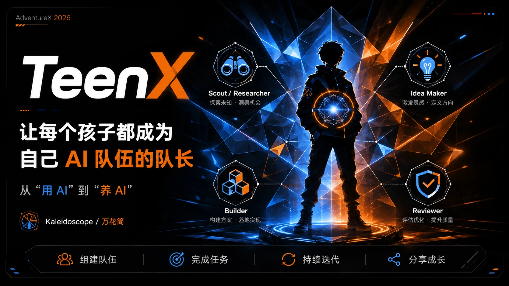

<p align="center">
  <a href="README.md">简体中文</a> &middot; <strong>English</strong>
</p>

<p align="center">
  
</p>

<h1 align="center">TeenX · An AI Team-Building Platform for Ages 11–16</h1>

<p align="center">
  Others give kids an AI tool. We give kids an AI team, and the responsibility of being its Captain.
</p>

<p align="center">
  <a href="#quickstart"><strong>Quickstart</strong></a> &middot;
  <a href="https://github.com/wunianze666-netizen/teenX"><strong>GitHub</strong></a> &middot;
  <a href="#architecture--security-boundaries"><strong>Architecture</strong></a> &middot;
  <a href="#current-limitations"><strong>Limitations</strong></a>
</p>

---

## What is TeenX

TeenX is an AI team-building platform for ages 11–16. Here, a child is not merely an AI user; they are the **Captain** of their first AI team: they assemble the team, name each member, assign tools, run tests, inspect the results, save versions, and iterate.

<p align="center">
  
</p>

Teams start from four role templates:

| Role template | Responsibility | Default tools |
| --- | --- | --- |
| Scout | Establish facts and constraints | Search, file reading |
| Inventor | Generate ideas and proposals | Search, image generation |
| Builder | Turn proposals into reality | Coding, image generation, docs |
| Critic | Find flaws and run quality checks | File reading, test running |

Kids can add members, remove members, rename them, and swap tools on top of the templates, shaping the team into their own.

<p align="center">
  
</p>

## The Core Loop

```
Define the team (add members / name them / assign tools / tune collaboration)
  → Test run (Run)
  → Inspect activity and work products (Work Product)
  → Save a version (Team Version)
  → Back to editing, keep iterating
```

Every change has consequences. Every run gives feedback. Every version can be revisited. The team is a long-term asset the child owns, not a disposable chat window.

## Terminology

The foundation is the Paperclip control plane; the surface speaks the child's vocabulary. The data model is unchanged, the semantics are remapped:

| Foundation (Paperclip) | What kids see (TeenX) |
| --- | --- |
| Company | Team |
| Agent | Member |
| Board User | Captain |
| Issue | Task |
| Work Product | Work Product |
| Heartbeat Run | Run |
| Activity Log | Activity |

## Official Arena Evaluation

Teams can prove themselves in the Arena. The Captain selects a team version, manually uploads a project ZIP archive, and enters a private evaluation:

1. Official challenges are versioned and published by the platform. Children do not create challenges.
2. Evaluation is strict static analysis: the submitted code is never built, executed, or rendered.
3. Eight dimensions on a 1000-point scorecard, with two independent judges per dimension plus arbitration, and evidence traceable to specific lines of code.
4. The evaluation state machine checkpoints every stage: runs recover from interruption, support cancellation, and retry safely.
5. The scorecard is stored as a team work product, visible only to the Captain.

This version deliberately ships no leaderboards, season points, or public submissions. Results exist for the Captain's own review and iteration.

<p align="center">
  
</p>

## Profile & Community

Every child has a public profile: the public ID is an irreversible opaque identifier, and nickname, team info, and forum activity are each gated by the child's own privacy settings. Contact details such as email addresses and phone numbers never appear in any child-visible API. Two Captains can open direct messages only with mutual consent, and blocking is always in the child's hands.

<p align="center">
  
</p>

The forum is an optional integration: a separate Discourse service (`teenx-forum/`) connected through a signed bridge and SSO. Posts and private messages are constrained by child-safety plugins, and members never auto-post.

## Architecture & Security Boundaries

```
┌─────────────────────────────────────────────────────────────┐
│ ui-advx/                    Child-facing UI (React + Vite)  │
│   Studio / Arena / Profile / Forum entry      (port 5174)   │
└──────────────────────────▲──────────────────────────────────┘
                           │ /api/advx/*
┌──────────────────────────┴──────────────────────────────────┐
│ server/                   Node.js service (Express, :3100)  │
│   routes/advx.ts          Teams, members, runs, versions,   │
│                           activity                          │
│   routes/advx-arena.ts    Challenges, submissions, runs,    │
│                           SSE, scorecards                   │
│   services/advx-mapper.ts Term mapping + field stripping    │
│   services/advx-arena/    Server-only: ZIP safety, scoring  │
│                           contract, model gateway,          │
│                           deterministic evaluator,          │
│                           checkpoint repository             │
├─────────────────────────────────────────────────────────────┤
│ packages/teams-catalog/   Four-role catalog (bundled/advx/) │
│ packages/db, etc.         Paperclip foundation, schema kept │
└─────────────────────────────────────────────────────────────┘
┌─────────────────────────────────────────────────────────────┐
│ teenx-forum/              Separately deployed Discourse     │
│   Signed bridge + child-safety plugins + Connect SSO        │
└─────────────────────────────────────────────────────────────┘
```

Security boundaries are release blockers, not afterthoughts:

- All budget, cost, credit, and model-parameter fields are stripped at the API layer. Child surfaces never see them.
- The platform pins one shared underlying model and exposes no model parameters or model choice to children.
- The approval gate (Governance & Approvals) stays intact underneath, but its policy configuration is never exposed to children.
- Arena internals stay server-only: prompts, full source, checkpoint paths, storage object keys, raw model errors, model endpoints, token usage, and cost data never leave through any API or SSE channel.
- Uploaded ZIPs pass layered validation: size and entry-count caps, path-traversal and symlink rejection, sensitive-file exclusion, and credential-line redaction.
- Official judging fails closed: without an exactly matching protected model configuration, a run is refused rather than silently degraded. Mock judging is local/test-only and every Mock score is permanently marked unofficial.
- The child-mode API is deny-by-default, and a Captain's public identity is an irreversible opaque ID.

## Quickstart

Requirements: **Node.js 20+**, **pnpm 9.15+**.

```bash
git clone https://github.com/wunianze666-netizen/teenX.git
cd teenX
pnpm install
pnpm dev
```

`pnpm dev` starts the API server at `http://localhost:3100` with an embedded PostgreSQL database created automatically. No extra setup needed.

In a second terminal, start the child-facing UI:

```bash
pnpm --filter @advx/ui dev
```

Then open **http://localhost:5174** and you are in TeenX.

## Verification

```bash
# End-to-end smoke (requires the server running on :3100)
bash scripts/advx-smoke.sh

# Arena smoke (upload, idempotency, scoring, redaction, activity; explicit Mock)
ADVX_ARENA_ALLOW_MOCK=true bash scripts/advx-arena-smoke.sh

# Server typecheck and Arena tests
pnpm --filter @paperclipai/server typecheck
pnpm --filter @paperclipai/server test -- arena

# Child UI typecheck and build
pnpm --filter @advx/ui typecheck
pnpm --filter @advx/ui build

# Role catalog manifest
pnpm --filter @paperclipai/teams-catalog build:manifest
```

## Shipped

- Full Studio loop: team and member lifecycle, test runs, activity, work products, version snapshots, and history inspection.
- Official Arena: challenge list and detail, ZIP upload with safety validation, idempotent runs, live SSE progress, cancel and resume, eight-dimension 1000-point scorecards.
- Captain profile: nickname and privacy settings, contacts (request / grant / block), public profile pages.
- Discourse forum integration: signed bridge, SSO, child-safety plugins for private messages.
- Four-role catalog packages plus a starter team (`packages/teams-catalog/catalog/bundled/advx/`).

## Current Limitations

- Test runs queue and are queryable, but real member execution requires a configured, protected model adapter credential. Without one, runs end in failure. That is expected.
- Arena official judging fails closed: without an exactly matching protected model configuration, runs are refused. Mock is local/test-only and its scores are always unofficial.
- Arena P0 supports a single server process. Database locks guarantee idempotency, but checkpoint scheduling is process-local.
- Submission ZIPs are uploaded manually by the Captain. Automatically producing a policy-constrained immutable ZIP from the team's work is not done yet.
- The forum requires a separately deployed Discourse service; it does not start with this repository.
- Two auto-provisioned helper members (Reflection Coach and Summarizer) may appear in the UI. They are not part of the four-role starter model.

## Next Steps (not shipped)

- Generate a policy-constrained, immutable submission ZIP from team work products.
- Evolve Arena from its single-process P0 into a safely scalable runtime.
- A richer catalog of role templates and tools.
- Runtime enforcement of collaboration relationships.

## Documentation

| Document | Contents |
| --- | --- |
| [docs/00-studio-v0.1.md](docs/00-studio-v0.1.md) | Full product spec: positioning, concepts, configuration model, architecture |
| [docs/PROJECT-INTRO.md](docs/PROJECT-INTRO.md) | Project introduction and philosophy |
| [docs/01-handoff-1-report.md](docs/01-handoff-1-report.md) | First engineering handoff completion report |
| [docs/09-handoff-9-report.md](docs/09-handoff-9-report.md) | Arena integration architecture, security boundaries, verification |
| [docs/10-handoff-10-report.md](docs/10-handoff-10-report.md) | Profile, contacts, and privacy safety report |
| [AGENTS.md](AGENTS.md) | Engineering rules for contributors |

## License

This repository is an independently evolving fork of [Paperclip](https://github.com/paperclipai/paperclip), under the [LICENSE](LICENSE) in this repository.

---

<p align="center">
  <sub>TeenX · Every child, the Captain of their own AI team.</sub>
</p>
